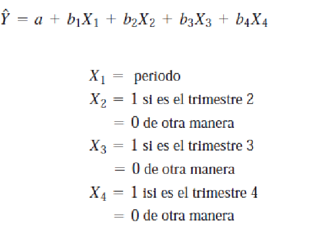

# Pronosticos
Generalmente se toman decisiones sin conocer el futuro.
## Pasos para elaborar un pronostico
1. Determinar el uso
2. Determinar los articulos o las cantidade que que se van a pronosticar
3. Determinar el horizonte de tiempo
4. Seleccionar el o los modelos de pronostico
5. Validar el modelo

## Modelos Cuantitativos para pronosticar

- ### Modelos de series de timepo
  - Se intenta predecir el futuro a partir de datos historicos.
- ### Modelos causales
  - Intentan incluir factores que influyen en el comportamiento de datos.
  - Normalmente se trabaja con analisis de regresion
- ### Modelos cualitativos
  - Se incorporan factores subjetivos como las opiniones de personas.

## Diagramas de dispersion y Series de tiempo

Un diagrama de dispersion para una serie de tiempo se grafica en dos dimensiones. con el tiempo en el eje horizontal. La variable que se pronostica(como las ventas) se coloca en el eje vertical.

## Medidas de exactitud del pronostico

### Desviacion Media Absoluta (DMA)
Es una medida de exactitud que es la suma de los valores absolutos de los errores de pronostivos individuales y luego se divide entre el numero de errores (n)

Me dice cuanto se separan unos datos de otros.

Se usa para comparar datos o la evaluacion de modelos para saber cual es mejor.

# Modelos Serie de tiempo
## Componenetes de una serie de tiemmpo
Analizar esto significa desglosar los datos historicos en sus componentes y luego proyectar hacia el futuro

3. Ciclos> son patrones en los datos anuale que ocurren cada cierto numero de años.
4. Variaciones aleatorias> son saltos en los datos ocasionados por el azar y por situaciones inusuales.

Entender los componenetes de una serie de tiempo ayuda a seleccionar la tecnica de pronosticos adecuada.

### Promedios Moviles
Un promedio movil de 4 meses por ejemplo se encuentra simplemente sumando

### Promedio Movil Ponderado
Permite asignar diferentes pesos a las observaciones previas.

Entonces se le pone mas peso a lo que ha sucedido mas reciente

---
Los promedios moviles simples y ponderados son efectivos en cuanto a suavizar fluctuaciones repentinas en el patron de demanda, con la finalidad de dar estimaicones

### Problemas
- Entre mas grande la cantidad de datos se pierde la confianza

---

## Suavizamiento Exponencial

### 1. Suavizamiento Exponencial con ajuste de tendencia
Si hay una tendencia presente en los datos deberia usar un modelo de pronostico que la incorpore de manera explicita al pronostico.

La idea es desarrollar un pronostico de suavizamiento exponencial utilizando α y β

Si los datos no son anuales y son menores a un año tenemos estacionalidad.

Si no son aleatorios, no muestran ciclos, usamos las dos primeras técnicas.

Si no son anuales, no tiene ciclos

1. La primera vez que se desarrolla un pronostico, debe darse o estimarse un pronostico anterior 'F'  si no, se toma el anterior. 
2. 
##  Proyecciones de tendencia
Otro método para pronósticos de series de tiempo con tendencia se
llama proyecciones de tendencia, que es una técnica que ajusta una
recta de tendencia a una serie de datos históricos y, luego, proyecta la
línea al futuro para obtener pronósticos a mediano y largo plazos

### Variaciones Estacionales

Un índice estacional indica la comparación de una estación dada (como
mes o trimestre) y una estación promedio. Cuando no hay una
tendencia, el índice se determina dividiendo el valor promedio para una
estación específica entre el promedio de todos los datos
Un índice de 1 significa que la estación es promedio. Por ejemplo, si las
ventas promedio en enero fueran de 120 y las ventas promedio en todos
los meses fueran de 200, el índice estacional para enero sería de
120/200 =0.60, de manera que enero está abajo del promedio.

### Variaciones Estacionales  con Tendencia
Cuando ambos componentes, de tendencia y estacional, están presentes
en una serie de tiempo, un cambio de un mes a otro se podría deber a
tendencia, variación estacional o simplemente a fluctuaciones aleatorias.
Para ayudar con este problema, deberían calcularse los índices
estacionales con un enfoque de promedio móvil centrado (PMC) siempre
que esté presente una tendencia.
Este enfoque previene que una variación causada por la tendencia se
interprete incorrectamente como una variación estacional.

Nos fijamos en estos datos para escoger metodos

1. Tendencia
2. Ciclos
3. Estacionalidad

### MÉTODO DE DESCOMPOSICIÓN DEL PRONÓSTICO CON COMPONENTES DE TENDENCIA Y ESTACIONAL

El proceso de aislar los factores de tendencia lineal y estacional para desarrollar pronósticos más exactos se llama descomposición.

1. El primer paso es calcular los índices estacionales para cada estación. Se utiliza el PMC
2. se elimina la estacionalidad de los datos dividiendo cada número
entre su índice estacional.
3. Después se encuentra una recta de tendencia usando los datos sin
estacionalidad.
4. Obtenemos la ecuación de la tendencia y esta ecuación sirve para
desarrollar el pronóstico basado en la tendencia, y el resultado se
multiplica por el índice estacional correspondiente para efectuar el
ajuste estacional.

### Uso de regresion con componentes de tendencia y estacional

Se puede utilizar la regresión múltiple para pronosticar cuando las
componentes de tendencia y estacional están presentes en una serie de
tiempo.
Una variable independiente es el tiempo, y otras variables
independientes son variables artificiales para indicar la estación.
Si pronosticamos datos trimestrales, hay cuatro categorías (trimestres),
por lo que se usan tres variables artificiales.

